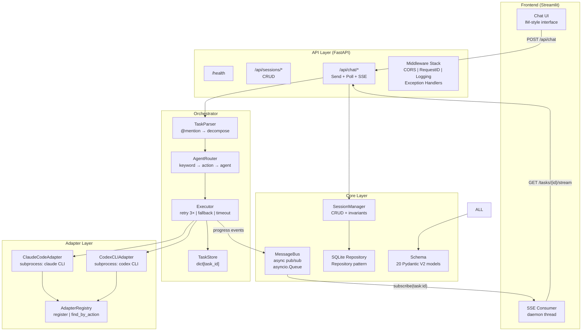

# AgentHub 面试准备手册

> 打印或放第二屏幕，面试前 30 分钟过一遍。

---

## 一、30 秒电梯演讲

> "我做的是一个**多 AI Agent 协作平台**，叫 AgentHub。核心解决的问题是：传统 AI 编程助手是 1v1 对话，你只能跟一个 Agent 聊。AgentHub 让你像管团队一样调度多个 AI Agent——你在聊天界面用自然语言描述复杂任务，系统自动拆解成子任务，根据能力路由给最合适的 Agent 并行执行，然后通过 SSE 实时流把每个 Agent 的结果推回来。技术栈 Python FastAPI + Streamlit + Docker，293 条测试，完整的 CI/CD 流水线。"

---

## 二、架构图

### 2.1 系统架构（Mermaid — GitHub 直接渲染）



### 2.2 一个请求的完整旅程

```
用户输入: "@claude 1. fix login bug  2. write tests  3. review code"
    │
    ▼
┌─ UI (app.py) ─────────────────────────────────────────────┐
│ POST /api/chat {session_id, content}                      │
│ _start_streaming(sid, task_id)  → daemon thread           │
└────────────────────┬──────────────────────────────────────┘
                     │
┌─ API (chat.py) ───▼──────────────────────────────────────┐
│ orchestrator.run_async(session_id, content)               │
│   → 201 {task_id, status:"running", sub_tasks: [...]}     │
└────────────────────┬──────────────────────────────────────┘
                     │
┌─ Orchestrator ─────▼──────────────────────────────────────┐
│ TaskParser.parse("@claude 1. fix login bug\n2. write...")│
│   ├─ extract_mentions()    → ["claude"]                   │
│   ├─ strip_mentions()      → "1. fix login bug\n2. ..."  │
│   └─ decompose_numbered()  → [SubTask("fix login bug"),  │
│                                SubTask("write tests"),    │
│                                SubTask("review code")]    │
│                                                            │
│ AgentRouter.assign(sub_tasks)                             │
│   ├─ _infer_action("fix login bug")   → "debugging"      │
│   ├─ _infer_action("write tests")     → "code_generation"│
│   ├─ _infer_action("review code")     → "code_review"    │
│   └─ registry.find_by_action(action)  → agent assignment │
│                                                            │
│ asyncio.create_task(_execute_background())                │
│   for each sub_task:                                      │
│     ├─ adapter.send_message(desc, context)                │
│     │   └─ ClaudeCodeAdapter → subprocess: claude -p "..."│
│     ├─ on_progress(st, result)                            │
│     │   ├─ MessageBus.publish("task:<id>", event)         │
│     │   └─ task_store[task_id] updated                    │
│     └─ (retry on failure, fallback if exhausted)          │
│   aggregate → final_result                                │
│   MessageBus.publish("task:<id>", complete_event)         │
└────────────────────┬──────────────────────────────────────┘
                     │
┌─ SSE Stream ───────▼──────────────────────────────────────┐
│ GET /api/chat/tasks/{id}/stream                           │
│   Phase 1: Replay completed sub-tasks                     │
│   Phase 2: Subscribe MessageBus("task:<id>")              │
│     → event: progress (agent X finished)                  │
│     → event: complete (all done, stream closes)           │
└────────────────────┬──────────────────────────────────────┘
                     │
┌─ UI Thread ────────▼──────────────────────────────────────┐
│ stream_buffer[sid].append(event)                          │
│ st.session_state.messages[sid].append(agent_msg)          │
│ is_streaming=False → st.rerun()                           │
└────────────────────────────────────────────────────────────┘
```

---

## 三、高频面试问题 & 回答要点

### Q1: 这个系统的核心价值是什么？

**一句话**: 从"雇一个 AI 程序员"升级到"管一个 AI 开发团队"。

**展开**:
- 传统 AI 工具是 1v1 的（你 ↔ 一个模型）
- AgentHub 是 1vN 的：你描述目标，系统自动分配任务给多个 Agent
- 类比：Jira 自动把 ticket 分配给最合适的工程师

### Q2: 架构中最大的技术挑战？

**回答**: **异步编排 + 实时反馈**。三个难点：

| 难点 | 解决方案 |
|------|----------|
| HTTP 请求不能等 Agent 执行完 | `run_async()` + `asyncio.create_task()` 后台执行 |
| SSE 不能丢失已完成事件 | 二阶段：先 replay 已完成子任务，再订阅 live |
| Streamlit 不支持 WebSocket/SSE | daemon 线程 + `session_state` + 自动 rerun |

### Q3: AgentRouter 为什么用 keyword 而不是 LLM 路由？

| 维度 | Keyword (当前) | LLM (未来) |
|------|---------------|------------|
| 延迟 | <1ms | 2-10s |
| 可靠性 | 确定性的 | 可能幻觉/格式错误 |
| 覆盖率 | 80% 场景 | 100% 场景 |
| 调试 | 查看关键字映射即可 | 需要分析 prompt |

20 个关键词覆盖 80% 场景。LLM 路由作为可插拔增强（已预留 `llm_decompose` 参数）。

### Q4: Agent 执行失败怎么办？

**回答**: 三级容错：

```
Level 1: Retry（默认 3 次）
  ├─ 临时错误（API quota、网络抖动）自动重试
  └─ 每次重试记录 attempt 计数
      ↓ 耗尽
Level 2: Fallback Agent
  ├─ 切换到配置的 fallback_agent（如 claude → codex）
  └─ 不同 Agent 有不同 API key，避免单点故障
      ↓ 也失败
Level 3: Graceful Degradation
  ├─ 该子任务标记 FAILED
  └─ 其他子任务不受影响，继续执行
```

### Q5: 为什么自研 MessageBus 而不是 Redis？

**回答**:
- v0.1 所有组件在**同一进程**中，`asyncio.Queue` 的 150 行实现满足需求
- **零延迟**（进程内通信，无网络序列化）
- **零运维**（不需要额外服务）
- **可替换接口**：MessageBus 已暴露 `subscribe/publish` API，未来接入 Redis/Kafka 只需换实现，不改业务代码

### Q6: Pydantic URL 为什么用 str 而不是 HttpUrl？

**回答**: 踩过的坑。`pydantic.HttpUrl` 序列化后变成 `pydantic_core.Url` 对象，传给 `json.dumps()`、Jinja2、LangGraph State 时抛 `TypeError`。Pydantic V2 的类型保留特性对下游有兼容性问题，所以统一用 `str`。

### Q7: 为什么前后端分两个 Docker 容器？

| 原因 | 说明 |
|------|------|
| 独立扩缩 | 前端无状态可任意扩容，后端按 Agent 负载扩容 |
| 独立部署 | 改 UI 不需要重启后端 |
| 网络安全 | 前端通过内部网络 `http://backend:8000` 调后端，不暴露后端端口 |
| 开发体验 | 本地可以只启后端（Swagger 调试）或全栈启动 |

### Q8: Streamlit vs React？

| 维度 | Streamlit | React |
|------|-----------|-------|
| 开发速度 | 2 天完成全功能 | 1-2 周 |
| 技术栈 | 纯 Python | JS/TS + Python |
| 目标用户 | 开发者工具 | 终端消费者 |
| 多用户 | 单用户模型 | 天然多租户 |
| 适合场景 | MVP、内部工具 | 生产级 SaaS |

AgentHub 定位是开发者工具 + MVP 阶段 → Streamlit 更合适。API 层已独立（`src/ui/api_client.py`），未来换 React 前端零后端改动。

### Q9: 如何扩展到 100 个 Agent？

1. **进程化 Agent**：每个 Agent 独立容器，通过 gRPC/消息队列通信
2. **Adapter 层升级**：subprocess → HTTP/gRPC 远程调用
3. **MessageBus 升级**：`asyncio.Queue` → Redis/NATS/Kafka（接口兼容，换实现即可）
4. **并行执行**：当前顺序执行，改为 `asyncio.gather()`（已预留 `on_progress` 支持）
5. **Registry 增强**：加健康检查定期探测、连接池、负载均衡

### Q10: 测试策略？

**回答**: 293 条测试覆盖四个层次：

| 层次 | 数量 | 覆盖内容 |
|------|------|----------|
| 单元测试 | ~220 | Schema 模型、Config 加载、Session CRUD、Keyword matching |
| 集成测试 | ~40 | SQLite 读写、Adapter Registry、Orchestrator 完整流程 |
| API 测试 | 38 | 8 个端点所有 HTTP 方法、422 验证、CORS、SSE |
| 端到端 | 16 | 真实 uvicorn server + HTTP client 完整链路 |

**关键**: 所有降级路径都有测试（Agent 失败、超时、fallback、空输入）。

---

## 四、5 分钟 Demo 脚本

### 终端 1 (后端)：

```bash
uvicorn src.api.app:create_app --factory --reload --port 8000
```

等待输出 `Application startup complete.`

### 浏览器：

打开 `http://localhost:8000/docs`

目标：展示 Swagger 自动生成的 API 文档。

### 终端 2 (测试 API)：

```bash
# 健康检查
curl -s http://localhost:8000/health | python -m json.tool

# 创建会话
curl -s -X POST http://localhost:8000/api/sessions/ \
  -H "Content-Type: application/json" \
  -d '{"title":"Demo","participants":["interviewer"]}'
# → 记下 session_id

# 发送多任务消息
curl -s -X POST http://localhost:8000/api/chat/ \
  -H "Content-Type: application/json" \
  -d '{"session_id":"<ID>","content":"1. design login API\n2. implement login\n3. write tests"}'

# SSE 流式
curl -N http://localhost:8000/api/chat/tasks/<TASK_ID>/stream
```

### Streamlit (如果时间允许)：

```bash
streamlit run src/ui/app.py
# → localhost:8501
```

展示：创建会话 → 发多任务消息 → Agent 逐个返回（流式效果）

### Docker (最后，展示工程能力)：

```bash
docker compose -f docker/docker-compose.yml up --build -d
curl http://localhost:8000/health
```

---

## 五、技术亮点速查表

| 亮点 | 一句话 |
|------|--------|
| **Schema-first 开发** | 20 个 Pydantic V2 模型，所有模块共享，避免接口不一致 |
| **策略模式 Adapter** | ABC 抽象基类，新增 Agent 只需实现 5 个方法 |
| **Repository 模式** | 接口与存储解耦，测试用 Memory，生产用 SQLite，可换 PostgreSQL |
| **pub/sub 解耦** | Orchestrator 不直接通知 UI，通过 MessageBus，松耦合 |
| **SSE 二阶段** | replay 防止事件丢失 + live 实时推送 |
| **Lifespan 模式** | 避免 `on_event` 弃用警告，启动时注入依赖 |
| **中间件栈** | CORS → RequestID → Logging → Exception Handler，每层独立测试 |
| **Docker 双容器** | 前后端分离，内部网络，各自 health check |
| **CI 四阶段** | test + lint + docker build + integration smoke，全自动 |

---

## 六、"如果再做一遍"（反思回答）

面试官几乎必问："你觉得有什么可以改进的？"

### 1. 并行执行子任务

**当前**: 子任务顺序执行（`for st in sub_tasks`）

**应该**: 无依赖的子任务用 `asyncio.gather()` 并行，吞吐提升 N 倍

**已预备**: `on_progress` 回调支持并行场景下每个子任务独立报告进度

### 2. LLM-based 任务分解

**当前**: 正则匹配编号列表和逗号分隔

**应该**: 对自然语言描述（"帮我搭一个完整的登录系统"），用 LLM 拆成 WBS

**已预备**: `TaskParser(llm_decompose=my_llm_func)` 参数已预留

### 3. 消息持久化

**当前**: MessageBus 不持久化，重启丢失未消费消息

**应该**: 加可选的事件日志（append-only file 或 Redis Stream），重启后回放

### 4. Agent 连接池

**当前**: 每次请求创建新的 subprocess

**应该**: 维护长连接或 subprocess 池，减少冷启动延迟

### 5. 前端多用户支持

**当前**: Streamlit 单用户模型

**应该**: 迁移到 React（`src/ui/api_client.py` 已独立，无后端改动）

---

## 七、快速记忆卡

```
项目名:    AgentHub
一句话:    多 Agent 协作平台 = 聊天界面 + 任务拆解 + 智能路由 + SSE 实时流
技术栈:    Python 3.11 / FastAPI / Streamlit / Pydantic V2 / Docker
测试:      293 passed
代码量:    ~8,200 lines / 34 files / 67 classes
核心模式:  Schema-first / Strategy / Repository / pub-sub
容错:      retry(3×) → fallback → graceful degradation
特色:      SSE 二阶段 / daemon 线程伪实时 / 中间件栈 / 双容器部署
```

---

> 打印此文件，面试前 30 分钟过一遍。重点：30 秒介绍 + Q1-Q5 回答要点 + Demo 脚本路径。
