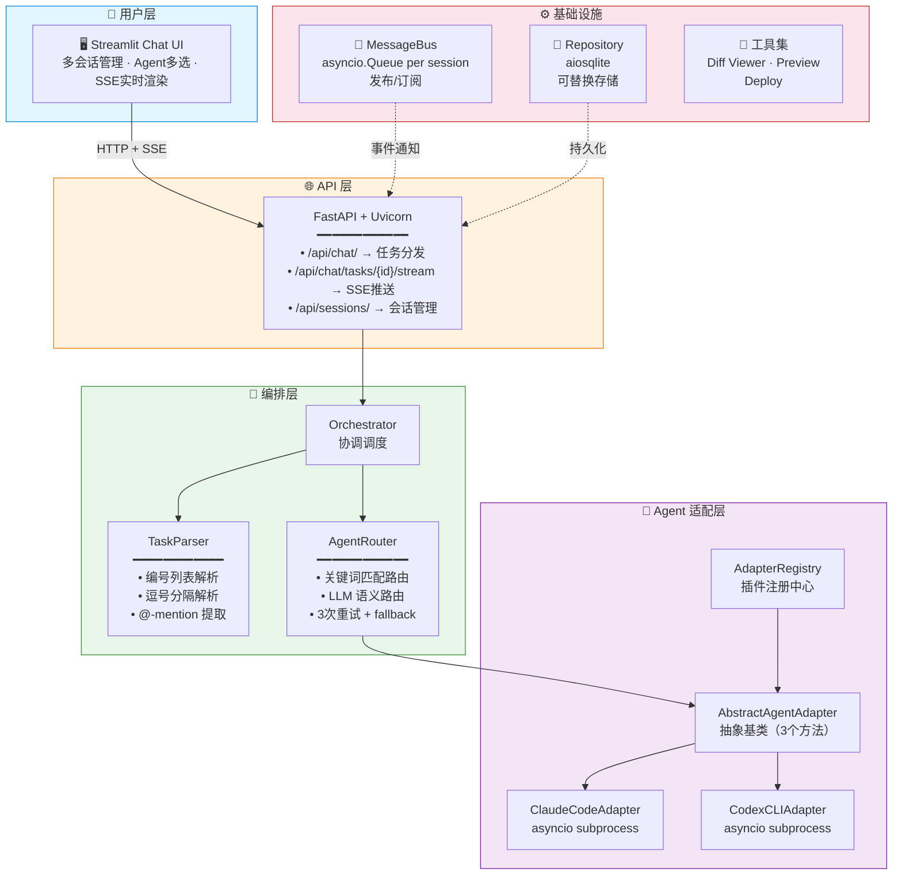

# 🤖 AgentHub — Multi-Agent Collaboration Platform

[](https://github.com/quannie255-star/AgentHub/actions/workflows/ci.yml)
[](https://www.python.org/)
[](https://fastapi.tiangolo.com/)
[](https://streamlit.io/)
[](tests/)
[](LICENSE)

**AgentHub** is an IM-style multi-AI-agent collaboration platform. Users describe complex tasks in natural language, and the system automatically decomposes them into sub-tasks, routes each to the most capable AI agent (Claude Code, Codex CLI, or custom agents), and streams results back in real time.

> Think: Slack for AI agents — you manage a team of AI assistants from a single chat interface.

---

## Architecture



## Quick Start

```bash
# Terminal 1: Backend
uvicorn src.api.app:create_app --factory --reload --port 8000

# Terminal 2: Frontend
streamlit run src/ui/app.py
# → Open http://localhost:8501
```

## Features

- **Multi-Agent Routing**: Keyword-based task → agent matching (`fix` → debugging → Claude)
- **Task Decomposition**: Numbered lists, comma-separated, @-mentions
- **SSE Streaming**: Real-time progress via Server-Sent Events (two-phase: replay + live)
- **Retry & Fallback**: 3 retries per sub-task + configurable fallback agent
- **IM-Style UI**: Streamlit chat interface with multi-select agent picker
- **Docker Deploy**: Separate backend + frontend containers with health checks
- **CI/CD**: GitHub Actions — pytest, ruff lint, Docker build, integration smoke test

## Tech Stack

| Layer | Technology |
|-------|-----------|
| Data Models | Pydantic V2 (20 models) |
| API Server | FastAPI + Uvicorn (lifespan pattern) |
| Real-time | SSE (Server-Sent Events) + custom async pub/sub MessageBus |
| Agent Integration | asyncio subprocess (CLI wrappers) |
| Storage | aiosqlite (Repository pattern, swappable) |
| Frontend | Streamlit (daemon thread SSE consumption) |
| Containerization | Docker ×2 + Compose |
| CI | GitHub Actions (4 jobs: test, lint, build, integration) |

## Project Structure

```
src/
├── core/           # Schema (20 Pydantic models), Config, Session, MessageBus
├── adapters/       # Abstract adapter ABC, Claude/Codex CLI wrappers, Registry
├── orchestrator/   # TaskParser, AgentRouter (retry/fallback), Orchestrator
├── repository/     # Abstract repos + SQLite implementation
├── tools/          # Diff viewer, Preview server, Deploy wrapper
├── api/            # FastAPI app, middleware (CORS/RequestID/logging), routes
└── ui/             # Streamlit app, sync HTTP client with SSE support
tests/              # 293 tests across all modules
```

## API Endpoints

| Method | Path | Description |
|--------|------|-------------|
| `GET` | `/health` | Health check (uptime, agent count) |
| `GET/POST` | `/api/sessions/` | List / Create sessions |
| `GET/DELETE` | `/api/sessions/{id}` | Get / Delete session |
| `PATCH` | `/api/sessions/{id}/archive` | Archive session |
| `POST` | `/api/chat/` | Send message → task_id (async, non-blocking) |
| `GET` | `/api/chat/tasks/{id}` | Poll task status |
| `GET` | `/api/chat/tasks/{id}/stream` | SSE streaming (text/event-stream) |

## Configuration

```bash
cp .env.example .env
# Edit: AGENTHUB_LLM_API_KEY=sk-...

# Or via environment:
export AGENTHUB_LLM__MODEL=claude-opus-4-8
export AGENTHUB_ORCHESTRATOR__DEFAULT_RETRIES=5
```

See `PROJECT_MANUAL.md` for deep-dive architecture docs and interview preparation guide.

## License

MIT
