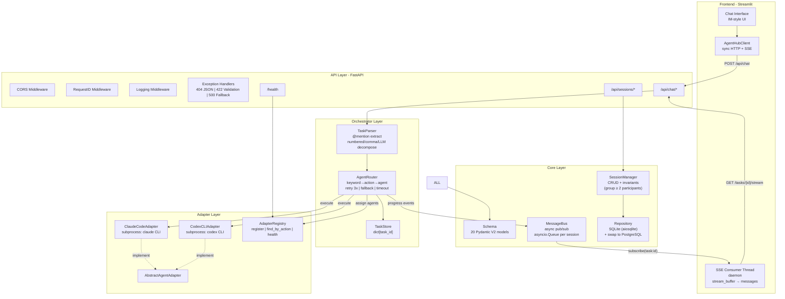
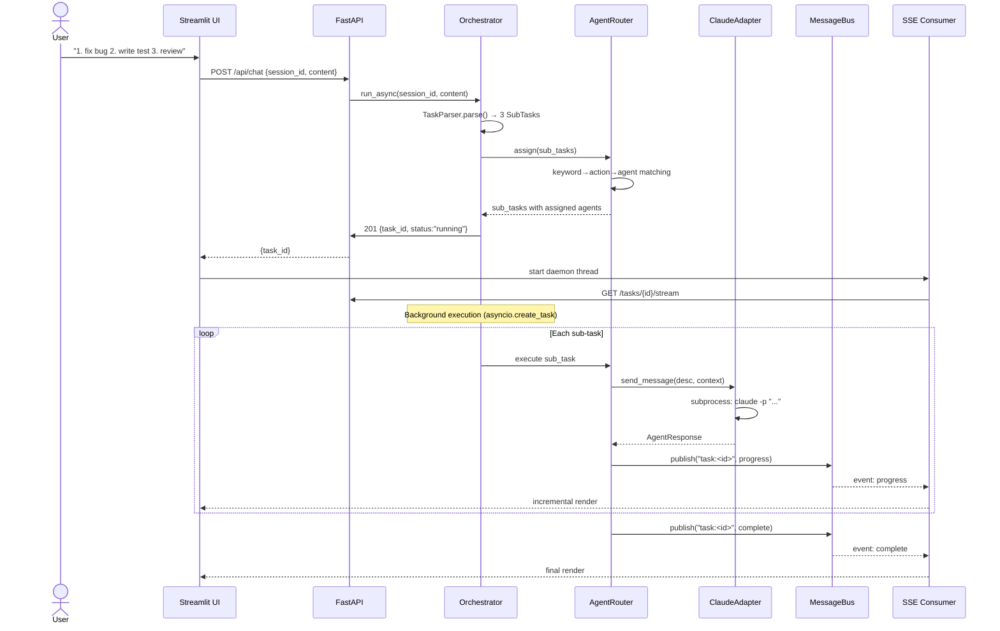
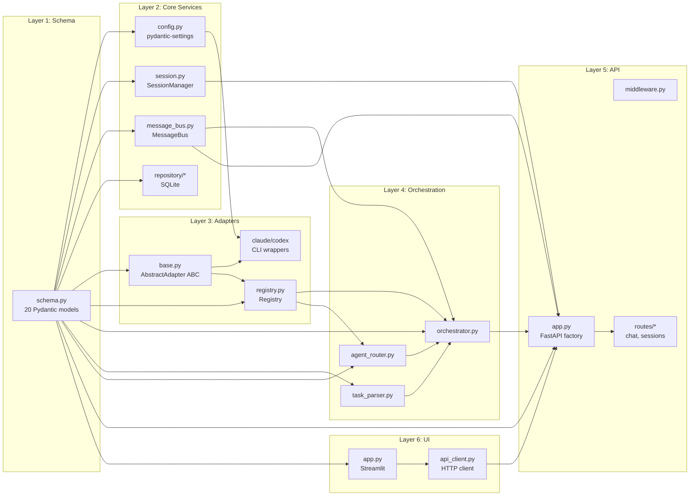
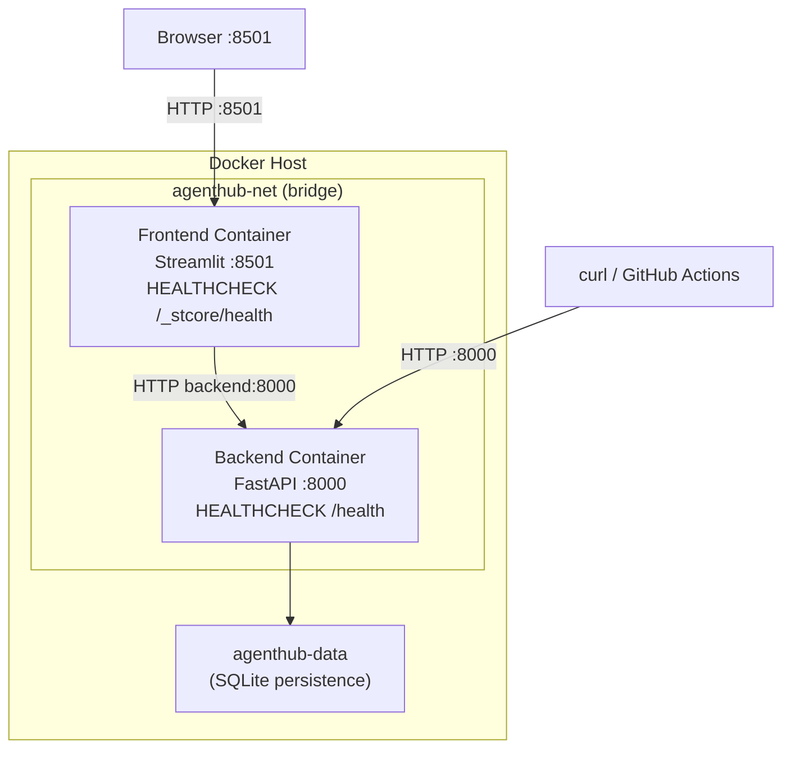

# AgentHub Architecture Diagram

This diagram is rendered natively by GitHub. View it at:
https://github.com/quannie255-star/AgentHub/blob/main/docs/ARCHITECTURE.md

To export as PNG:
1. Open this file on GitHub
2. Right-click the diagram → Copy image
3. Or paste the Mermaid code into https://mermaid.live → Export PNG

---

## System Architecture (Data Flow)

---

## Request Lifecycle (Sequence)

---

## Component Dependency

---

## Deployment Architecture

---

> Diagrams rendered with Mermaid. View on GitHub for live rendering.
